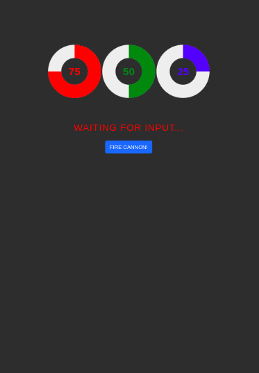

# vortexCannon-AP
This is a repository containing the code for GPIO control and the browser interface for my vortex cannon project. The code is written for the ESP32 microcontroller using the Arduino IDE. The system utilizes both cores and the built in memory of the ESP32 as a wireless access point (+captive portal), SPIFFS filesystem to host a HTTP server on address 192.168.1.1 and GPIO handling. 

